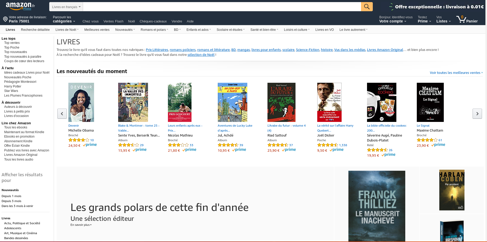

# Devoir n°01 BIS

- Date de rendu : 10 décembre 2018 à 10h00
- Travail individuel
- Projet à envoyer
  - sous forme d'archive zip
  - à contact@maximepawlak.fr
  - objet : "[ESICAD] Devoir n°01 BIS - {NOM - Prénom}

## Cahier des charges

- Reproduire la page suivante https://www.amazon.fr/livre-achat-occasion-litterature-roman/b/ref=nav_shopall_lv?ie=UTF8&node=301061

- HEADER
  - logo
  - barre de recherche avec bouton (sans la loupe)
  - trois liens : Compte, Listes, Panier
- Barre de catégorie
  - Livres de Noël
  - Meilleures ventes
  - Nouveautés
  - ...
- Sidebar
  - avec uniquement 3 catégories et 3 sous-catégorie pour chacune:
  - Les tops
  - Top ventes
  - Top poche
  - Top Nouveautés
  - A l'actu
    - ...
- La section horizontale LIVRES
- La section Nouveautés du moment
  - avec 6 livres
    - image
    - titre
    - prix

## Conseils

- Utiliser git
- Indenter votre code
